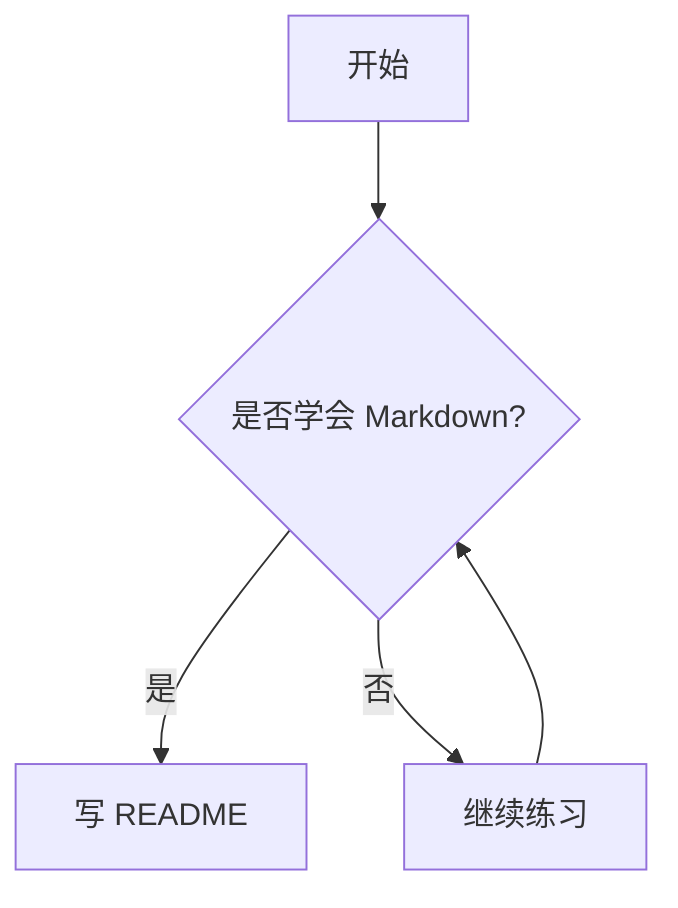
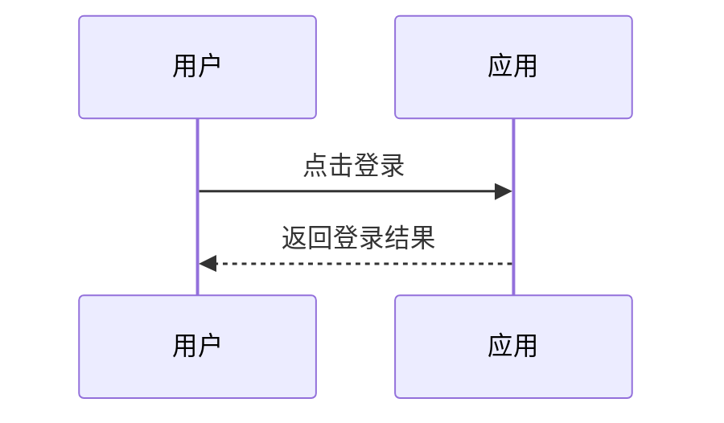

# Markdown 学习 README

<!--
  这是给 Markdown 小白准备的学习文件。
  你可以一边看“显示效果”，一边看“写法示例”。
  Markdown 注释写法就是这样的：
  <!-- 这里是注释内容 -->
  注意：注释通常不会显示在最终预览页面里。
-->

## 目录

- [1. Markdown 是什么](#1-markdown-是什么)
- [2. 标题](#2-标题)
- [3. 段落和换行](#3-段落和换行)
- [4. 强调：加粗、斜体、删除线](#4-强调加粗斜体删除线)
- [5. 列表](#5-列表)
- [6. 任务清单](#6-任务清单)
- [7. 链接](#7-链接)
- [8. 图片](#8-图片)
- [9. 引用](#9-引用)
- [10. 代码](#10-代码)
- [11. 分割线](#11-分割线)
- [12. 表格](#12-表格)
- [13. 转义字符](#13-转义字符)
- [14. HTML 标签](#14-html-标签)
- [15. 注释](#15-注释)
- [16. 锚点跳转](#16-锚点跳转)
- [17. 脚注](#17-脚注)
- [18. 折叠内容](#18-折叠内容)
- [19. 数学公式](#19-数学公式)
- [20. Mermaid 图表](#20-mermaid-图表)
- [21. GitHub 常用写法](#21-github-常用写法)
- [22. README 常用模板](#22-readme-常用模板)
- [23. 学习建议](#23-学习建议)

---

## 1. Markdown 是什么

Markdown 是一种轻量级标记语言。

你不用写复杂代码，只需要用一些简单符号，就能写出：

- 标题
- 列表
- 表格
- 链接
- 图片
- 代码块
- 引用
- README 文档

常见使用场景：

- GitHub 项目的 `README.md`
- 学习笔记
- 博客文章
- 项目文档
- 接口说明
- 软件使用说明

文件后缀通常是：

```text
.md
.markdown
```

---

## 2. 标题

Markdown 用 `#` 表示标题。

`#` 越少，标题越大；`#` 越多，标题越小。

### 写法示例

```markdown
# 一级标题
## 二级标题
### 三级标题
#### 四级标题
##### 五级标题
###### 六级标题
```

### 显示效果

# 一级标题示例

## 二级标题示例

### 三级标题示例

#### 四级标题示例

##### 五级标题示例

###### 六级标题示例

<!-- 建议：一个 README 里通常只写一个一级标题。 -->

---

## 3. 段落和换行

### 普通段落

Markdown 中，直接写文字就是段落。

### 写法示例

```markdown
这是第一段文字。

这是第二段文字。
```

### 显示效果

这是第一段文字。

这是第二段文字。

### 换行

如果只是按一次回车，很多 Markdown 预览器会把它当成同一个段落。

想强制换行，可以在行尾加两个空格，或者使用 `<br>`。

### 写法示例

```markdown
第一行后面有两个空格  
第二行

第一行<br>
第二行
```

### 显示效果

第一行后面有两个空格  
第二行

第一行<br>
第二行

---

## 4. 强调：加粗、斜体、删除线

### 写法示例

```markdown
*斜体*
_斜体_

**加粗**
__加粗__

***加粗并斜体***
___加粗并斜体___

~~删除线~~
```

### 显示效果

*斜体*

_斜体_

**加粗**

__加粗__

***加粗并斜体***

___加粗并斜体___

~~删除线~~

<!-- 建议：平时优先使用 *斜体* 和 **加粗**，比较常见。 -->

---

## 5. 列表

## 无序列表

无序列表可以用 `-`、`*` 或 `+`。

### 写法示例

```markdown
- 苹果
- 香蕉
- 橙子

* 前端
* 后端
* 测试

+ HTML
+ CSS
+ JavaScript
```

### 显示效果

- 苹果
- 香蕉
- 橙子

* 前端
* 后端
* 测试

+ HTML
+ CSS
+ JavaScript

## 有序列表

### 写法示例

```markdown
1. 第一步
2. 第二步
3. 第三步
```

### 显示效果

1. 第一步
2. 第二步
3. 第三步

## 嵌套列表

子列表前面通常缩进两个或四个空格。

### 写法示例

```markdown
- 前端
  - HTML
  - CSS
  - JavaScript
- 后端
  - Node.js
  - Java
  - Python
```

### 显示效果

- 前端
  - HTML
  - CSS
  - JavaScript
- 后端
  - Node.js
  - Java
  - Python

---

## 6. 任务清单

任务清单常用于 GitHub issue、README、TODO。

### 写法示例

```markdown
- [x] 学习标题
- [x] 学习列表
- [ ] 学习表格
- [ ] 学习代码块
```

### 显示效果

- [x] 学习标题
- [x] 学习列表
- [ ] 学习表格
- [ ] 学习代码块

<!-- [x] 表示已完成，[ ] 表示未完成，中间要有一个空格。 -->

---

## 7. 链接

## 普通链接

### 写法示例

```markdown
[百度](https://www.baidu.com)
[GitHub](https://github.com)
```

### 显示效果

[百度](https://www.baidu.com)

[GitHub](https://github.com)

## 带标题提示的链接

鼠标移动到链接上时，可能会显示提示文字。

### 写法示例

```markdown
[GitHub](https://github.com "代码托管平台")
```

### 显示效果

[GitHub](https://github.com "代码托管平台")

## 直接显示网址

### 写法示例

```markdown
<https://github.com>
```

### 显示效果

<https://github.com>

## 邮箱链接

### 写法示例

```markdown
<example@example.com>
```

### 显示效果

<example@example.com>

---

## 8. 图片

图片写法和链接很像，只是前面多了一个 `!`。

### 写法示例

```markdown

```

例如：

```markdown

```

### 显示效果


## 本地图片

如果图片和 README 在同一个目录：

```markdown

```

如果图片放在 `images` 文件夹：

```markdown

```

<!-- 图片说明也叫 alt 文本。图片加载失败时，会显示这段说明。 -->

---

## 9. 引用

引用用 `>` 表示。

### 写法示例

```markdown
> 这是一段引用。

> 这是第一层引用。
>> 这是第二层引用。
>>> 这是第三层引用。
```

### 显示效果

> 这是一段引用。

> 这是第一层引用。
>> 这是第二层引用。
>>> 这是第三层引用。

引用里也可以放列表：

```markdown
> 学习计划：
>
> - 学 HTML
> - 学 CSS
> - 学 JavaScript
```

> 学习计划：
>
> - 学 HTML
> - 学 CSS
> - 学 JavaScript

---

## 10. 代码

## 行内代码

行内代码用一对反引号包起来。

### 写法示例

```markdown
使用 `npm install` 安装依赖。
```

### 显示效果

使用 `npm install` 安装依赖。

## 代码块

代码块用三个反引号包起来。

### 写法示例

````markdown
```javascript
const message = "Hello Markdown";
console.log(message);
```
````

### 显示效果

```javascript
const message = "Hello Markdown";
console.log(message);
```

## 常见代码块语言

```markdown
```html
<h1>Hello</h1>
```

```css
body {
  color: red;
}
```

```javascript
console.log("Hello");
```

```python
print("Hello")
```

```bash
npm install
```
```

<!-- 在三个反引号后面写语言名，可以让代码有语法高亮。 -->

---

## 11. 分割线

分割线可以用三个或更多 `-`、`*`、`_`。

### 写法示例

```markdown
---

***

___
```

### 显示效果

---

***

___

---

## 12. 表格

表格由表头、分隔线、内容行组成。

### 写法示例

```markdown
| 姓名 | 年龄 | 职业 |
| --- | --- | --- |
| 小明 | 18 | 学生 |
| 小红 | 20 | 前端开发 |
```

### 显示效果

| 姓名 | 年龄 | 职业 |
| --- | --- | --- |
| 小明 | 18 | 学生 |
| 小红 | 20 | 前端开发 |

## 表格对齐

### 写法示例

```markdown
| 左对齐 | 居中 | 右对齐 |
| :--- | :---: | ---: |
| A | B | C |
| 100 | 200 | 300 |
```

### 显示效果

| 左对齐 | 居中 | 右对齐 |
| :--- | :---: | ---: |
| A | B | C |
| 100 | 200 | 300 |

<!--
  :---  表示左对齐
  :---: 表示居中
  ---:  表示右对齐
-->

---

## 13. 转义字符

如果你想显示 Markdown 符号本身，可以在前面加反斜杠 `\`。

### 写法示例

```markdown
\# 这不是标题
\* 这不是列表
\[这不是链接文字\]
\`这不是代码\`
```

### 显示效果

\# 这不是标题

\* 这不是列表

\[这不是链接文字\]

\`这不是代码\`

常见需要转义的字符：

```text
\   反斜杠
`   反引号
*   星号
_   下划线
{}  花括号
[]  方括号
()  圆括号
#   井号
+   加号
-   减号
.   点
!   感叹号
|   竖线
```

---

## 14. HTML 标签

很多 Markdown 解析器支持直接写 HTML。

### 换行

```markdown
第一行<br>
第二行
```

第一行<br>
第二行

### 居中

```markdown
<p align="center">这段文字居中显示</p>
```

<p align="center">这段文字居中显示</p>

### 图片设置宽度

```markdown

```

<!-- 注意：不同平台对 HTML 的支持程度不一样。GitHub 支持常见 HTML，但不支持所有标签和样式。 -->

---

## 15. 注释

Markdown 注释使用 HTML 注释语法。

### 写法示例

```markdown
<!-- 这是一条注释，预览时通常不会显示 -->
```

### 多行注释

```markdown
<!--
这是多行注释。
可以写很多说明。
预览页面里通常看不到。
-->
```

### 使用场景

- 给自己留提醒
- 解释某段 Markdown 为什么这样写
- 临时隐藏某一段内容
- 给团队成员写内部说明

示例：

```markdown
<!-- TODO: 后面补充项目截图 -->
<!-- 注意：发布前检查链接是否可访问 -->
```

<!-- 这是一条真实注释，正常预览时你不会看到它。 -->

---

## 16. 锚点跳转

锚点可以让你点击目录后跳转到对应标题。

在 GitHub 中，标题通常会自动生成锚点。

例如这个标题：

```markdown
## 学习 Markdown
```

它通常可以这样跳转：

```markdown
[跳转到学习 Markdown](#学习-markdown)
```

规则大致是：

- 英文字母变小写
- 空格变成 `-`
- 大多数标点符号会被删除
- 中文标题一般可以直接使用中文

### 手写锚点

也可以用 HTML 自己写一个锚点：

```markdown
<a id="my-anchor"></a>

[跳转到指定位置](#my-anchor)
```

---

## 17. 脚注

脚注适合补充说明。

并不是所有 Markdown 工具都支持脚注，但 GitHub 支持。

### 写法示例

```markdown
这是一个带脚注的句子。[^1]

[^1]: 这是脚注内容。
```

### 显示效果

这是一个带脚注的句子。[^1]

[^1]: 这是脚注内容。

---

## 18. 折叠内容

折叠内容常用于隐藏较长说明。

这是 HTML 的 `<details>` 和 `<summary>` 标签。

### 写法示例

```markdown
<details>
<summary>点击展开更多内容</summary>

这里是被折叠的内容。

- 可以放列表
- 可以放代码
- 可以放图片

</details>
```

### 显示效果

<details>
<summary>点击展开更多内容</summary>

这里是被折叠的内容。

- 可以放列表
- 可以放代码
- 可以放图片

</details>

---

## 19. 数学公式

部分 Markdown 工具支持 LaTeX 数学公式。

GitHub、Typora、Obsidian、很多博客系统都支持，但效果可能略有不同。

## 行内公式

### 写法示例

```markdown
这是行内公式：$a + b = c$
```

### 显示效果

这是行内公式：$a + b = c$

## 块级公式

### 写法示例

```markdown
$$
E = mc^2
$$
```

### 显示效果

$$
E = mc^2
$$

---

## 20. Mermaid 图表

Mermaid 可以用文本画流程图、时序图等。

GitHub、Typora、Obsidian 等工具支持 Mermaid。

## 流程图

### 写法示例

````markdown

````

### 显示效果


## 时序图

### 写法示例

````markdown

````

### 显示效果


---

## 21. GitHub 常用写法

## 提及用户

```markdown
@username
```

## 提及 issue 或 PR

```markdown
#123
```

## 表情

```markdown
:smile:
:rocket:
:white_check_mark:
```

显示效果依赖平台。

## 提交记录链接

```markdown
提交记录：abcdef123456
```

GitHub 可能会自动把 commit hash 变成链接。

## 警告提示块

GitHub 支持下面这种提示块。

### 写法示例

```markdown
> [!NOTE]
> 这是普通提示。

> [!TIP]
> 这是技巧提示。

> [!IMPORTANT]
> 这是重要提示。

> [!WARNING]
> 这是警告提示。

> [!CAUTION]
> 这是谨慎提示。
```

### 显示效果

> [!NOTE]
> 这是普通提示。

> [!TIP]
> 这是技巧提示。

> [!IMPORTANT]
> 这是重要提示。

> [!WARNING]
> 这是警告提示。

> [!CAUTION]
> 这是谨慎提示。

---

## 22. README 常用模板

下面是一个项目 README 的常见结构。

你以后写项目说明时，可以直接复制这个模板再改。

````markdown
# 项目名称

<!-- 简单说明这个项目是做什么的 -->

## 项目简介

这里写项目介绍。

## 功能特性

- 功能 1
- 功能 2
- 功能 3

## 技术栈

- HTML
- CSS
- JavaScript

## 目录结构

```text
project-name/
├── index.html
├── style.css
├── main.js
└── README.md
```

## 安装和运行

```bash
npm install
npm run dev
```

## 使用说明

这里写怎么使用项目。

## 截图


## 开发计划

- [x] 完成首页
- [ ] 完成登录
- [ ] 完成部署

## 常见问题

### 问题 1：为什么运行失败？

回答：先检查依赖是否安装。

## 作者

你的名字

## 许可证

MIT
````

---

## 23. 学习建议

作为新手，你可以按下面顺序学习：

1. 先学标题、段落、加粗、列表。
2. 再学链接、图片、代码块。
3. 然后学表格、任务清单、引用。
4. 最后学 Mermaid、脚注、折叠内容等高级写法。

最重要的是多写。

你可以新建一个 `test.md`，每天练习下面这些内容：

```markdown
# 今天的学习笔记

## 今天学了什么

- Markdown 标题
- Markdown 列表
- Markdown 代码块

## 遇到的问题

> 这里写遇到的问题。

## 明天计划

- [ ] 继续练习 README
- [ ] 给自己的项目写文档
```

---

## 快速速查表

| 功能 | 写法 |
| --- | --- |
| 一级标题 | `# 标题` |
| 二级标题 | `## 标题` |
| 加粗 | `**文字**` |
| 斜体 | `*文字*` |
| 删除线 | `~~文字~~` |
| 无序列表 | `- 内容` |
| 有序列表 | `1. 内容` |
| 任务清单 | `- [ ] 任务` |
| 链接 | `[文字](地址)` |
| 图片 | `` |
| 引用 | `> 内容` |
| 行内代码 | `` `代码` `` |
| 代码块 | 三个反引号包裹代码 |
| 分割线 | `---` |
| 表格 | `| 表头 | 表头 |` |
| 注释 | `<!-- 注释 -->` |
| 转义 | `\*显示星号\*` |

---

## 最后提醒

Markdown 的核心不是背语法，而是多写文档。

刚开始你只要会这几个就够用了：

- `#` 写标题
- `-` 写列表
- `**文字**` 写加粗
- `[文字](链接)` 写链接
- `` 写图片
- 三个反引号写代码块

<!--
  学习建议：
  每次看到好看的 README，都可以点开源文件看看别人是怎么写 Markdown 的。
-->
